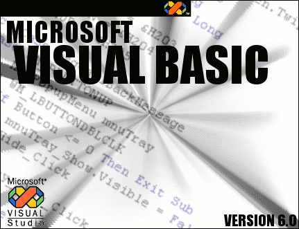

<div align="center">

## Replacing your VB Splash Screen


</div>

### Description

This article shows you how to replace your boring old Visual Basic Splash screen with a new, cooler one! Diagrams, tool links and step-by-step how-to's. Comment and vote!
 
### More Info
 


<span>             |<span>
---                |---
**Submitted On**   |2004-12-24 17:50:42
**By**             |[Grayda](https://github.com/Planet-Source-Code/PSCIndex/blob/master/ByAuthor/grayda.md)
**Level**          |Intermediate
**User Rating**    |5.0 (10 globes from 2 users)
**Compatibility**  |VB 5\.0, VB 6\.0
**Category**       |[Miscellaneous](https://github.com/Planet-Source-Code/PSCIndex/blob/master/ByCategory/miscellaneous__1-1.md)
**World**          |[Visual Basic](https://github.com/Planet-Source-Code/PSCIndex/blob/master/ByWorld/visual-basic.md)
**Archive File**   |[Replacing\_18334012262004\.zip](https://github.com/Planet-Source-Code/grayda-replacing-your-vb-splash-screen__1-57912/archive/master.zip)


### Source Code

```
<b>Turorial is included in attached zip file</b>
<br><br>
Don't forget to comment and vote
```

